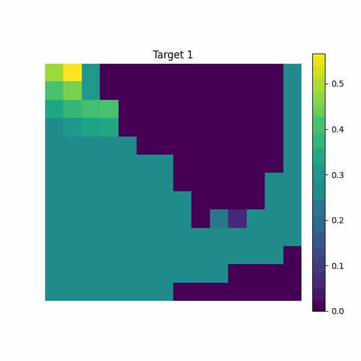
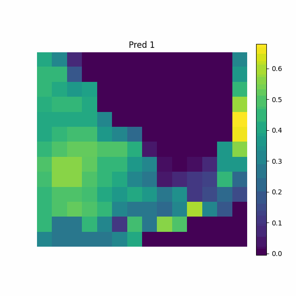
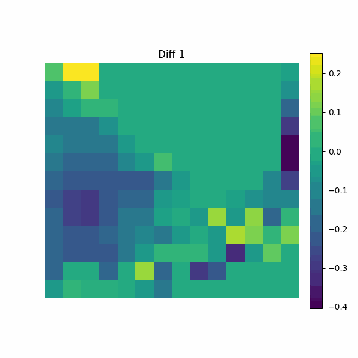
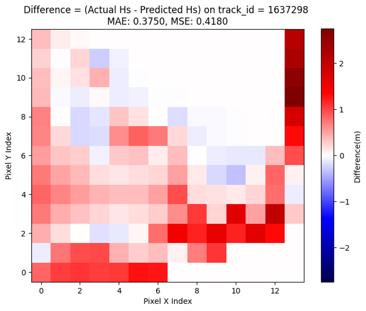

# AI Tools for Surrogate MIKE21

GitHub Repository by Tianju(Tim) Du

## Table of Contents

1. [ Introduction ](#intro)
2. [ Installation ](#install)
3. [ Dataset ](#data)
4. [ PCA Latent Space Model ](#obj1)
5. [ Results ](#res)
6. [ Testing ](#tests)
7. [ Licence ](#licence)

## Introduction

Severe hurricanes, such as Irma in 2017 and Ian in 2022, have underscored the immense financial devastation that storm surges can cause along Florida's coastline, leading to widespread flooding and expensive recovery efforts. While numerical models like MIKE 21 are traditionally employed to predict the Significant Wave Height (Hs) of storm surges, these models are often computationally intensive. This repository, *AI Tools for Surrogate MIKE21*, aims to address this challenge by developing machine learning models that act as efficient surrogates to MIKE 21, delivering faster and accurate predictions of Hs. The main branch showcases the functionality of the best-performing model, PCA-TCN_LSTM, while other models referenced in the Independent Research Project Final Report are available in the developing_models branch.

## Installation

1. To clone the GitHub repository, run the following code in your terminal at a chosen directory:
   
   ```bash
   git clone https://github.com/ese-msc-2023/irp-td323.git
   ```
2. Navigate to the cloned project directory:
   
   ```bash
   cd irp-td323
   ```
3. Create the atlas conda environment (`python 3.11` or higher):
   
   ```bash
   conda create -n mike21  python=3.11
   ```
4. Activate the conda environment:
   
   ```bash
   conda activate mike21
   ```
5. Navigate to the root directory (contains the `\irp-td323` directory) and install the package:
   
   ```bash
   pip install -e .
   ```
   
   Note: The package is installed as an editable using `-e` so that any changes will be automatically updated.
6. To see the installed package, run:
   
   ```bash
   pip list
   ```

## Dataset

Mike21 input datasets dfsu_grid were used to train the models in this repository:

`dfsu_grid`: Dataset of MIKE21 input and output csv. The dataset represents 432 indiviudal track scenairos each with 182 grid points and 97 time step long. The data is ordered sequentially, simulating the evolution of the storm surge.

### Visualising the Storm Surge Propagation🚀️

<div align="center">
  
</div>

<hr style="border: none; border-top: 2px solid fire;"/>

# ⏳ MIKE21 Surrogate Model using PCA Temporal Convolutional LSTM

Use a combined deep learning model to train a surrogate model of a MIKE21 model on Latent space.

### Notebook

In the `demo.ipynb` file, it demonstrates the entire workflow of the model. First, it show how to preprocess the data and train the model. Then, we illustrate how to generate prediction results and compare them with the maximum Hs value, real images and tracks.

## PCA TCN-LSTM Model Architecture

`Temporal Convolutional Network (TCN)`: The model starts with a Temporal Convolutional Network, which consists of stacked dilated convolutional layers. The TCN is designed to capture long-range dependencies in the input sequence through dilated convolutions, ReLU activations, and dropout layers, ensuring robust feature extraction over time.

`LSTM Layer`: The output from the TCN is passed to an LSTM layer, which is designed to capture the temporal dynamics of the sequence data. The LSTM layer processes the sequential features to model time dependencies more effectively.

`Fully Connected Layer`: Finally, the output from the LSTM is passed through a fully connected layer to produce the final predictions, matching the desired output size. This layer maps the hidden state of the LSTM to the target space, generating the model's output.

### Original and Reconstructed Images

The model first compress and then decompress the MIKE21 inputs and MIKE21 output data using the trained PCA model to demonstrate the effectiveness of the dimensionality reduction.

## Results👍

**Resulting Storm Surge Hs Prediction**:

<div style="display: flex; justify-content: center; align-items: center;">



</div>

**Resulting Peak Value Predicton**:

<div align="center">
   
</div>

"Each pixel in this figure represents the difference between the maximum values at a specific grid point for a given track.

**Errors (MSE) of peak values**

- MAE: 0.375
- MSE: 0.418

## Testing👀️

This repository includes several tests, which you can use to check its operation on your system. When you are in the 'mike21' environment, the tests can be run by entering this code in terminal:

```
pytest
```

## License

This project is licensed under the MIT License - see [License.md](License.md)

